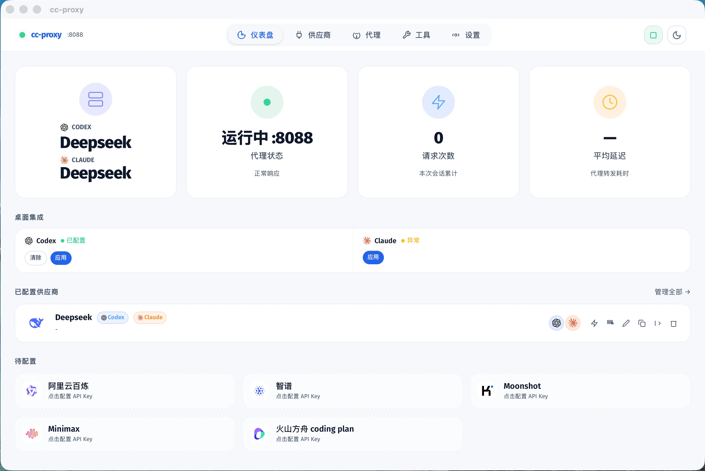

# cc-proxy

<p align="center">
  <a href="https://github.com/chenyubinqi/cc-proxy/stargazers"></a>
  <a href="LICENSE"></a>
  <a href="https://nodejs.org/"></a>
  <a href="https://github.com/chenyubinqi/cc-proxy/releases"></a>
  <a href="https://github.com/chenyubinqi/cc-proxy/releases/latest"></a>
</p>

<p align="center">
  
  <br>
  <em>主界面 — 仪表盘、供应商管理、请求监控</em>
</p>

cc-proxy 是面向 Claude Code / Codex / Warp 的本地大模型代理工具。它将 OpenAI Responses API 和 Anthropic Messages API 转换为国内大模型的 Chat Completions API，并以 macOS 菜单栏应用的形式运行，无 Dock 占用。

## 设计原则

代理只做协议转发和兼容适配，不做额外逻辑处理，不修改模型意图。

- **协议转发** — `/v1/chat/completions` 请求原样透传，流式/非流式响应直接 pipe
- **协议适配** — `/v1/responses`（OpenAI 新 API）和 `/v1/messages`（Anthropic API）自动转换为 Chat Completions 格式，响应再转回原格式
- **模型映射** — 自动将 `gpt-5`、`gpt-5-codex` 等模型名映射为国内模型，可自定义
- **推理兼容** — DeepSeek V4 等原生推理模型的 `reasoning_content` 自动在 Responses ↔ Chat 协议间双向转换，支持 Codex/Warp stateless 多轮推理保鲜

## 能做什么

- 管理 DeepSeek、阿里云百炼、智谱 GLM、Moonshot、MiniMax、火山方舟等国内大模型供应商。
- 一键切换供应商，代理自动重启生效。
- 自动将 Claude Code / Codex 的境外模型名映射为国内模型，每个供应商独立配置。
- 实时显示每条请求的模型路由和响应状态。
- 内置供应商连接测速和余额查询。
- 纯菜单栏应用，关闭窗口即隐藏到后台，代理持续运行。

## 下载

前往 [GitHub Releases](https://github.com/chenyubinqi/cc-proxy/releases) 下载最新版本：

- `cc-proxy_<version>_aarch64.dmg`：macOS 拖拽安装包

macOS 版本暂时没有 Apple 开发者签名，系统可能提示无法验证开发者。首次打开请在终端执行：

```bash
xattr -cr "/Applications/cc-proxy.app"
```

## 快速开始

1. 下载并打开 cc-proxy。
2. 在「供应商」页面选择一个供应商预设，填入 API Key。
3. 按需调整模型映射。
4. 回到「仪表盘」点击供应商旁的开关，一键切换。
5. 将 Claude Code / Codex 的 API endpoint 指向 `http://127.0.0.1:8088`。

默认代理端口：`8088`（可在设置中修改）。

## 代理接口

cc-proxy 在本机启动一个 HTTP 代理，对外提供以下端点：

| 端点 | 说明 |
|------|------|
| `GET /health` | 健康检查 |
| `GET /v1/models` | 模型列表（支持 `?format=anthropic` 返回 Anthropic 格式） |
| `POST /v1/chat/completions` | OpenAI Chat Completions（透传） |
| `POST /v1/responses` | OpenAI Responses API → Chat Completions（协议转换） |
| `POST /v1/messages` | Anthropic Messages API → Chat Completions（协议转换） |

## 内置供应商

| 供应商 | Base URL |
|--------|----------|
| DeepSeek | `https://api.deepseek.com` |
| 阿里云百炼 | `https://dashscope.aliyuncs.com/compatible-mode` |
| 智谱 GLM | `https://open.bigmodel.cn/api/paas` |
| Moonshot | `https://api.moonshot.cn` |
| MiniMax | `https://api.minimax.io` |
| 火山方舟 Coding | `https://ark.cn-beijing.volces.com/api/coding/v3` |

## 模型映射

Claude Code / Codex 使用 `gpt-5`、`gpt-5-codex`、`gpt-4.1`、`o4-mini` 等境外模型名发起请求。cc-proxy 会自动将其映射为当前供应商的国内模型：

```
gpt-4.1     → 供应商默认模型
gpt-5       → 供应商默认模型（建议配置为高级模型）
gpt-5-codex → 供应商默认模型（建议配置为高级模型）
o4-mini     → 供应商默认模型
```

每个供应商的映射可在编辑页面自定义。

## 配置文件

应用首次启动时自动在 `~/.cc-proxy/` 创建配置文件：

| 文件 | 说明 |
|------|------|
| `.env` | 代理运行时配置（端口、供应商、API Key 等） |
| `providers.json` | 供应商预设配置（API 地址、模型映射等） |
| `server.cjs` | Node.js 代理服务脚本 |

也可通过应用内界面可视化编辑，无需手动修改文件。

## 本地开发

```bash
git clone https://github.com/chenyubinqi/cc-proxy.git
cd cc-proxy
npm install
npm run tauri dev
```

构建：

```bash
npm run tauri build
```

构建产物位于 `src-tauri/target/release/bundle/macos/`。

## 更新日志

### v2.1.0

- **推理内容双向转换** — `reasoning_content` 在 Responses ↔ Chat Completions 协议间自动转换，支持 DeepSeek V4 等原生推理模型
- **Stateless 多轮推理保鲜** — 支持 `encrypted_content` 机制，Warp 和 Codex 的 stateless 模式下推理内容不会在回合间丢失
- **供应商配置向后兼容** — `providers.json` 同时支持旧字段（`baseUrl`）和新字段（`codexBaseUrl`/`claudeBaseUrl`）
- **调试日志开关** — 设置 → 高级配置中可开启调试日志，方便排查问题（`DEBUG_REASONING=1`）
- **开发体验优化** — `npm run tauri dev` 自动同步 `server.cjs`，无需手动拷贝

### v2.0.0

- 双模式供应商配置（Codex + Claude 独立供应商）
- Codex Desktop 一键集成
- 日志噪音过滤

## 常见问题

### 代理无法启动

1. 确认 Node.js 已安装：`node --version`（需要 18+）
2. 检查 `~/.cc-proxy/.env` 中 `TARGET_API_KEY` 已配置
3. 在设置中开启调试日志，查看 `~/.cc-proxy/debug_logs/` 排查

### Claude Code / Codex 连接代理失败

确认代理已启动（菜单栏图标为绿色），检查端口是否被占用：

```bash
lsof -i :8088
```

### Codex 提示 "reasoning_content must be passed back"

这是 DeepSeek V4 等推理模型的已知行为。升级到 v2.1.0 即可自动处理。临时解决：在 Codex 中开一个新会话。

### 关闭窗口后代理还在运行吗

是的。关闭窗口只是隐藏界面，代理在后台持续运行。要停止代理，点击菜单栏图标 → 停止按钮。

### 应用无法打开

macOS 可能阻止未签名应用，在终端执行：

```bash
xattr -cr "/Applications/cc-proxy.app"
```

## 技术栈

- **桌面框架**：Tauri 2
- **前端**：React 18 + TypeScript + Tailwind CSS + Zustand
- **代理服务**：Node.js（CommonJS，零外部依赖）
- **构建**：Vite

## 免责声明

本项目与 Anthropic、OpenAI、Codex 以及任何第三方模型服务商没有从属关系。你的 API Key 只保存在本机 `~/.cc-proxy/` 目录中，不会上传到任何服务器。

## 许可证

MIT License
